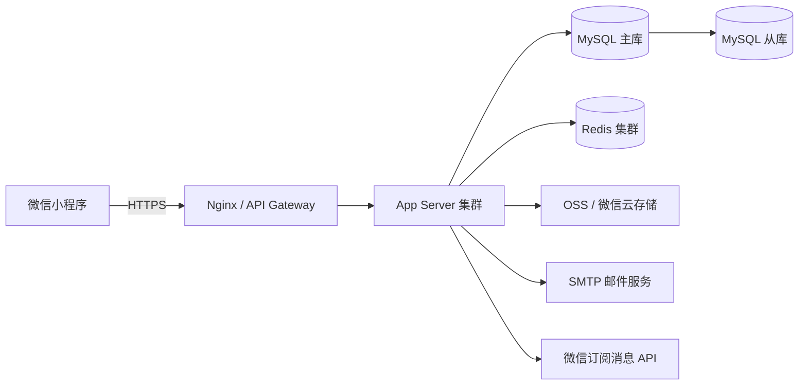
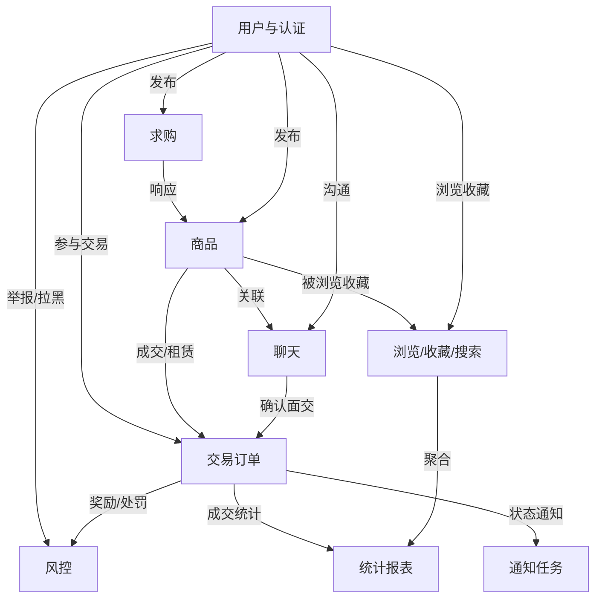
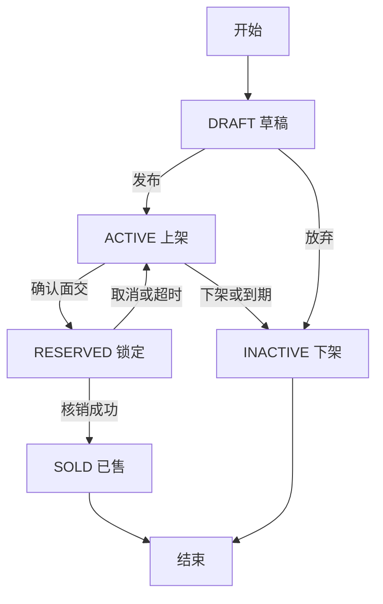
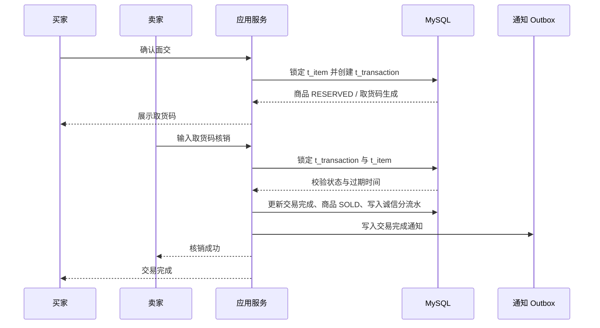
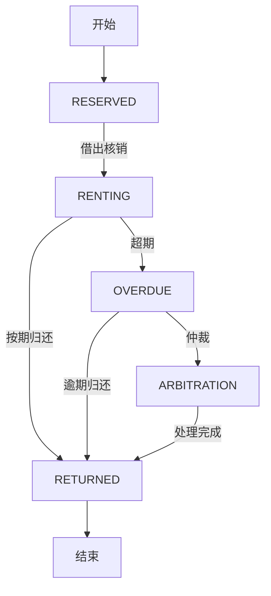
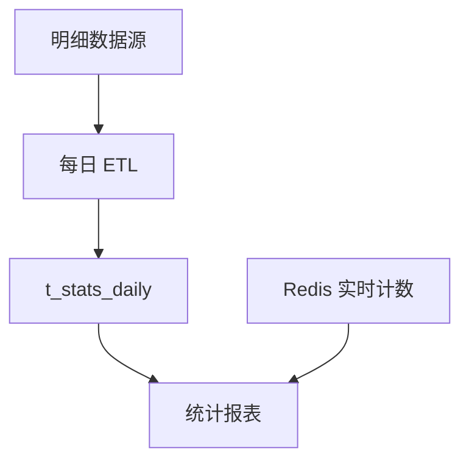
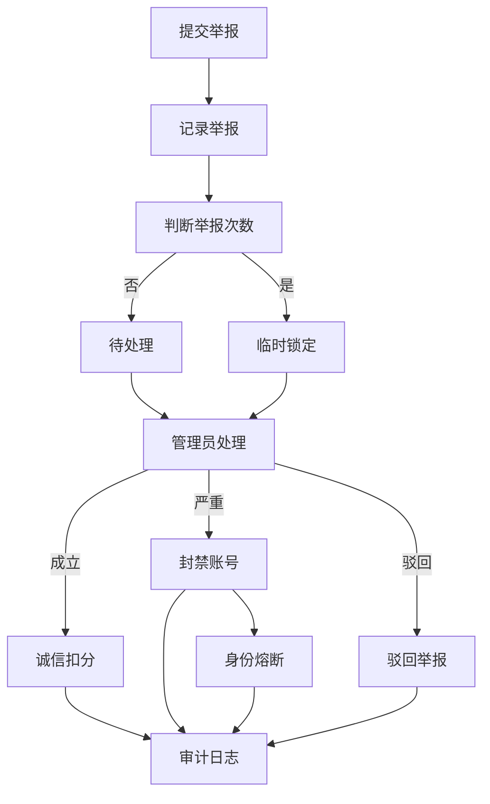

# CAU 校园二手交易微信小程序数据库设计说明书

**Database Design Document (DDD)**

| 项目 | 内容 |
| --- | --- |
| 项目名称 | CAU 校园二手交易微信小程序 |
| 文档类型 | 数据库设计说明书 Database Design Document (DDD) |
| 文档版本 | V1.1 |
| 编写日期 | 2026-06-16 |
| 依据文档 | `SRS-CAU校园二手交易小程序.pdf`、`SDD-CAU校园二手交易小程序概要设计说明书.pdf`、`SDDD-CAU校园二手交易小程序详细设计说明书.pdf` |
| 目标数据库 | MySQL 8.0 / InnoDB |
| 团队成员 | 张优（组长/需求分析/数据架构与系统安全）、杨海弋（前端开发）、曹育祯（后端开发）、付智霖（算法与数据）、黄小帅（接口集成） |
| 文档状态 | 汇报 |

## 修订记录

| 版本 | 日期 | 修订说明 | 修订人 | 状态 |
| --- | --- | --- | --- | --- |
| V1.0 | 2026-06-12 | 基于 SRS V1.2、SDD V1.2、SDDD V1.0 编写数据库设计，覆盖消息、收藏、求购响应、埋点、搜索日志、身份熔断与审计表设计 | 张优 | 设计稿 |
| V1.1 | 2026-06-16 | 增加目录、术语表、数据量估算、部署架构、事务流程图、设计决策记录；展开物理表枚举定义并强化答辩结论 | 张优 | 汇报 |

## 1. 引言

### 1.1 编写目的

本文档定义 CAU 校园二手交易微信小程序的数据模型、物理表结构、字段约束、索引策略、事务一致性、备份恢复和数据安全要求。本文档面向后端开发、测试、数据库实施、项目管理和后续维护人员。

本文档以用户认证、商品流转、求购响应、站内聊天、取货码核销、租赁履约、风控治理和运营统计为核心数据域，明确各业务数据的持久化边界、关联关系和一致性规则。

### 1.2 设计范围

本 DDD 覆盖以下业务域：

| 业务域 | 覆盖内容 |
| --- | --- |
| 用户与认证 | 微信 OpenID 用户、CAU 邮箱认证、认证等级、二级密码、毕业降级、角色权限 |
| 商品 | 商品发布、草稿、上架、锁定、售出、下架、租赁属性、图片 URL |
| 求购 | 求购帖、求购响应、自动匹配与计数 |
| 交易 | 普通交易取货码、租赁借出/归还双阶段核销、跨校区标识、并发控制 |
| 聊天 | 会话、消息历史、消息加密、已读状态 |
| 风控 | 诚信分、举报、个人黑名单、平台封禁、身份熔断 |
| 行为与统计 | 浏览历史、收藏、搜索日志、页面事件、日统计聚合 |
| 管理与审计 | 管理员操作审计、异步通知 outbox |

### 1.3 设计原则

1. 所有核心业务状态必须可落库追踪，不能只依赖前端状态或 Redis。
2. 金额、状态、认证等级、诚信分等字段必须由数据库约束和 Service 校验共同保证。
3. 普通查询优先性能，交易核销和诚信分变更优先一致性。
4. 用户隐私字段不得明文扩散，聊天消息、手机号、学号等敏感数据必须加密或脱敏处理。
5. 统计报表使用预聚合，严禁后台报表直接扫描聊天内容或暴露个人隐私。
6. 删除策略采用逻辑下架和外键限制为主，不能随意物理删除交易和风控证据。

### 1.4 术语与缩写

| 缩写/术语 | 全称 | 说明 |
| --- | --- | --- |
| CAU | China Agricultural University | 中国农业大学 |
| DDD | Database Design Document | 数据库设计说明书 |
| OpenID | Open Identifier | 微信平台为每个用户分配的唯一标识 |
| HMAC | Hash-based Message Authentication Code | 用于取货码不可逆校验，数据库不保存明文取货码 |
| BCrypt | Blowfish-based Password Hashing | 二级密码哈希算法 |
| AES-256-GCM | Advanced Encryption Standard Galois/Counter Mode | 敏感字段加密方案，具备完整性校验能力 |
| JWT | JSON Web Token | 登录态与接口认证令牌 |
| RBAC | Role-Based Access Control | 基于角色的访问控制 |
| ETL | Extract-Transform-Load | 离线抽取、转换和加载，用于统计预聚合 |
| ACID | Atomicity, Consistency, Isolation, Durability | 数据库事务四特性 |
| OSS | Object Storage Service | 对象存储服务，用于商品图片和举报证据图 |
| RPO | Recovery Point Objective | 数据恢复点目标 |
| RTO | Recovery Time Objective | 数据恢复时间目标 |

## 2. 设计依据与需求追踪

### 2.1 源文档要点

| 来源 | 数据库相关要点 |
| --- | --- |
| SRS | 覆盖认证、交易、聊天、风控、浏览历史和数据统计需求 |
| SDD | 给出用户、商品、求购、交易、聊天、风控和统计等核心表 |
| SDDD | 给出核心实体字段、枚举、DAO/Service 依赖、核心索引、关键业务约束和事务隔离策略 |

### 2.2 需求到表追踪矩阵

| 需求 | 数据表 | 说明 |
| --- | --- | --- |
| 微信登录与 CAU 邮箱认证 | `t_user`、`t_identity_blacklist` | 用户主档、邮箱唯一绑定、永久身份封禁 |
| 二级密码 | `t_user` | 保存 BCrypt 哈希，不保存明文密码 |
| 商品发布与管理 | `t_item` | 商品主表，覆盖普通售卖、赠送、租赁 |
| 商品收藏 | `t_favorite` | 记录用户对商品的收藏关系 |
| 求购发布 | `t_request` | 求购帖主表 |
| “我有它”响应 | `t_request_response` | 记录求购帖、响应卖家与可供商品之间的关系 |
| 站内聊天 | `t_chat_session`、`t_message` | 记录会话与消息历史 |
| 取货码交易闭环 | `t_transaction` | 普通交易取货码与租赁双阶段核销 |
| 诚信分 | `t_user`、`t_credit_log` | 当前分值与变动流水 |
| 举报与仲裁 | `t_report_log`、`t_admin_audit_log` | 举报证据、处理状态、管理员操作 |
| 最近浏览 | `t_browse_history` | 每用户最多 20 条，重复浏览更新时间 |
| 黑名单 | `t_blacklist`、`t_identity_blacklist` | 个人黑名单与平台级身份熔断 |
| 搜索关键词统计 | `t_search_log`、`t_stats_daily` | 明细日志与日聚合 |
| 页面点击与活跃统计 | `t_event_log`、`t_stats_daily` | 埋点明细与运营报表 |
| 通知可靠性 | `t_notification_outbox` | 核销、逾期、举报等通知失败可补偿 |

## 3. 数据库环境与通用规范

### 3.1 数据库选型

| 项 | 设计 |
| --- | --- |
| 关系数据库 | MySQL 8.0 |
| 存储引擎 | InnoDB |
| 字符集 | `utf8mb4` |
| 排序规则 | `utf8mb4_0900_ai_ci` |
| 事务隔离默认值 | `READ COMMITTED`；关键写场景配合显式行锁 |
| 缓存 | Redis，用于验证码、限流、热门榜、在线人数、消息实时推送 |
| 对象存储 | OSS/微信云存储，数据库仅保存 URL 和元数据 |

### 3.2 数据量级预估

本系统面向校园级二手交易场景，初期按 500 名日活用户规模估算。数据量级用于指导索引、归档和统计预聚合设计，后续可根据真实运营数据调整。

| 数据表 | 预估日增量 | 预估年增量 | 存储策略 |
| --- | --- | --- | --- |
| `t_user` | 20 新用户/天 | 约 7,300 行 | 长期保留，注销后做匿名化或冻结处理 |
| `t_item` | 50 条发布/天 | 约 18,250 行 | 长期保留，通过状态字段区分上架、售出和下架 |
| `t_request` | 20 条求购/天 | 约 7,300 行 | 长期保留，过期后状态归档 |
| `t_transaction` | 30 笔交易/天 | 约 10,950 行 | 长期保留，作为交易证据链 |
| `t_message` | 500 条消息/天 | 约 182,500 行 | 长期保留或按年度归档 |
| `t_event_log` | 5,000 条事件/天 | 约 1,825,000 行 | 保留 90 天明细，长期保留聚合结果 |
| `t_search_log` | 200 条搜索/天 | 约 73,000 行 | 保留 180 天明细 |
| `t_stats_daily` | 2 行/天 | 约 730 行 | 长期保留，用于报表和趋势分析 |

### 3.3 数据库部署架构

部署说明：

| 组件 | 职责 |
| --- | --- |
| App Server 集群 | 承载 REST API、WebSocket、事务逻辑、权限校验 |
| MySQL 主库 | 承载核心写入、交易核销、诚信分变更 |
| MySQL 从库 | 承载报表查询、后台检索和只读分析 |
| Redis 集群 | 验证码、限流、在线人数、热门榜、消息实时通道 |
| OSS / 微信云存储 | 商品图片、举报证据图、导出报表文件 |
| SMTP / 微信 API | 邮箱验证码与交易状态通知 |

### 3.4 命名规范

| 对象 | 规范 | 示例 |
| --- | --- | --- |
| 表名 | 小写蛇形命名，以 `t_` 开头 | `t_item` |
| 主键 | 业务表使用 `{entity}_id` | `item_id` |
| 外键 | 引用表主键原名或语义名 | `seller_id`、`buyer_id` |
| 索引 | `uk_` 唯一索引，`idx_` 普通索引，`ft_` 全文索引 | `uk_email_address` |
| 时间字段 | 创建时间 `created_at`，更新时间 `updated_at`，完成时间按业务命名 | `finish_time` |
| 布尔字段 | `is_`、`has_` 前缀 | `is_banned` |
| 枚举字段 | 使用英文大写枚举值 | `ACTIVE`、`EAST` |

### 3.5 通用字段约定

除日志和少数纯关联表外，业务主表建议包含以下通用字段：

| 字段 | 类型 | 说明 |
| --- | --- | --- |
| `created_at` | `DATETIME NOT NULL DEFAULT CURRENT_TIMESTAMP` | 创建时间 |
| `updated_at` | `DATETIME NOT NULL DEFAULT CURRENT_TIMESTAMP ON UPDATE CURRENT_TIMESTAMP` | 更新时间 |

除不可变流水表外，业务主表应保留 `updated_at`，用于审计、调试、增量同步和数据修复。用户注销、商品下架、求购关闭等场景优先通过状态字段表达，不直接物理删除核心业务数据。

## 4. 概念数据模型

### 4.1 核心实体

| 实体 | 描述 |
| --- | --- |
| User | 微信用户与 CAU 校园身份 |
| Item | 二手商品、赠送物品或租赁物品 |
| Request | 求购需求 |
| Transaction | 面交交易或租赁交易 |
| ChatSession | 商品维度的买卖双方聊天会话 |
| Message | 会话消息 |
| CreditLog | 诚信分变动记录 |
| ReportLog | 举报和仲裁记录 |
| BrowseHistory | 最近浏览 |
| Blacklist | 用户个人黑名单 |
| StatsDaily | 运营统计日聚合 |

### 4.2 ER 图

说明：本图使用中文业务实体展示核心关系，避免在一张图中堆叠所有物理表。物理表与业务实体的对应关系如下：

| 中文实体 | 对应物理表 |
| --- | --- |
| 用户与认证 | `t_user`、`t_identity_blacklist` |
| 商品 | `t_item` |
| 求购 | `t_request`、`t_request_response` |
| 聊天 | `t_chat_session`、`t_message` |
| 交易订单 | `t_transaction` |
| 风控 | `t_credit_log`、`t_report_log`、`t_blacklist`、`t_admin_audit_log` |
| 浏览/收藏/搜索 | `t_browse_history`、`t_favorite`、`t_search_log`、`t_event_log` |
| 统计报表 | `t_stats_daily` |
| 通知任务 | `t_notification_outbox` |

### 4.3 数据表联动关系

| 业务链路 | 参与数据表 |
| --- | --- |
| 用户认证 | `t_user`、`t_identity_blacklist`、`t_admin_audit_log` |
| 商品发布 | `t_user`、`t_item`、`t_event_log`、`t_stats_daily` |
| 商品浏览与收藏 | `t_item`、`t_browse_history`、`t_favorite`、`t_event_log` |
| 求购响应 | `t_user`、`t_request`、`t_request_response`、`t_item`、`t_chat_session` |
| 站内聊天 | `t_chat_session`、`t_message`、`t_blacklist`、`t_report_log` |
| 普通交易 | `t_item`、`t_transaction`、`t_credit_log`、`t_notification_outbox` |
| 租赁交易 | `t_item`、`t_transaction`、`t_credit_log`、`t_report_log`、`t_notification_outbox` |
| 风控治理 | `t_report_log`、`t_credit_log`、`t_blacklist`、`t_identity_blacklist`、`t_user`、`t_admin_audit_log` |
| 运营统计 | `t_user`、`t_item`、`t_transaction`、`t_search_log`、`t_event_log`、`t_stats_daily` |

联动说明：

- 用户认证：用户通过微信 OpenID 创建 `t_user` 记录；邮箱认证前查询身份熔断表；管理员调整认证或封禁状态时写入审计日志。
- 商品发布：用户认证等级和诚信分决定是否可发布；发布成功写入商品表；浏览、点击和分类行为进入事件日志，并在 ETL 后汇总到日统计表。
- 商品浏览与收藏：查看商品详情时更新浏览历史和商品浏览量；收藏/取消收藏维护用户与商品的多对多关系；相关行为进入埋点日志。
- 求购响应：买家发布求购帖；卖家点击“我有它”后生成响应记录，可关联已发布商品，并可进一步创建聊天会话。
- 站内聊天：发起聊天前检查双方黑名单关系；会话表保存会话入口，消息表保存加密消息；聊天异常可通过举报表留存证据。
- 普通交易：买卖双方确认面交后，商品从 `ACTIVE` 变为 `RESERVED`，生成交易与取货码；核销成功后交易完成、商品变为 `SOLD`，同时写入诚信分流水和通知任务。
- 租赁交易：租赁商品通过借出码进入 `RENTING`；归还码核销后完成交易；逾期或损坏可进入举报与诚信分处理流程。
- 风控治理：举报处理可触发诚信分调整、平台封禁、身份熔断或个人黑名单；管理员处理结果均写入审计日志。
- 运营统计：日活、新增、发布量、成交量、搜索词、页面点击等明细由 ETL 聚合到 `t_stats_daily`，后台报表只读取聚合结果。

### 4.4 典型数据流

1. 商品发布数据流：`t_user` 权限校验 -> `t_item` 写入商品 -> `t_event_log` 记录发布事件 -> ETL 汇总 `t_stats_daily.total_published`。
2. 求购撮合数据流：`t_request` 发布求购 -> `t_request_response` 记录卖家响应 -> 可关联 `t_item` -> 创建 `t_chat_session` 并写入 `t_message`。
3. 面交核销数据流：`t_chat_session` 沟通确认 -> `t_transaction` 生成取货码 -> `t_item.item_status` 更新为 `RESERVED` -> 核销后更新 `t_transaction` 和 `t_item` -> 写入 `t_credit_log` 与 `t_notification_outbox`。
4. 风控处理数据流：`t_report_log` 提交举报 -> 管理员处理写入 `t_admin_audit_log` -> 必要时更新 `t_user.is_banned`、写入 `t_credit_log` 或 `t_identity_blacklist`。
5. 统计报表数据流：`t_search_log` 和 `t_event_log` 保存明细 -> 定时 ETL 汇总 `t_user`、`t_item`、`t_transaction` 数据 -> 写入 `t_stats_daily` -> 管理后台读取聚合报表。

### 4.5 商品生命周期状态图

### 4.6 普通交易核销时序图

### 4.7 租赁交易状态图

说明：租赁状态由 `t_transaction.rental_status` 记录，商品表仍通过 `t_item.item_status` 维护是否可被再次交易。

### 4.8 统计 ETL 数据流图

### 4.9 风控处理流程图

## 5. 枚举与数据字典

### 5.1 认证与角色

| 枚举 | 值 | 含义 |
| --- | --- | --- |
| `auth_level` | `L0` | 游客，仅浏览 |
| `auth_level` | `L1` | CAU 邮箱认证用户 |
| `auth_level` | `L2` | 补充学号/姓名/证件核验用户 |
| `role_type` | `STUDENT` | 普通学生/校友 |
| `role_type` | `ADMIN` | 管理员 |
| `role_type` | `MERCHANT` | 商户扩展预留 |

### 5.2 校区、商品和交易状态

| 枚举 | 值 | 含义 |
| --- | --- | --- |
| `campus_area` | `EAST` | 东校区 |
| `campus_area` | `WEST` | 西校区 |
| `campus_area` | `BOTH` | 双校区/均可 |
| `item_status` | `DRAFT` | 草稿 |
| `item_status` | `ACTIVE` | 上架 |
| `item_status` | `RESERVED` | 已锁定，等待核销 |
| `item_status` | `SOLD` | 已售/交易完成 |
| `item_status` | `INACTIVE` | 下架、过期或屏蔽 |
| `transaction_type` | `SALE` | 普通交易 |
| `transaction_type` | `RENTAL` | 租赁交易 |
| `token_status` | `UNUSED` | 未使用 |
| `token_status` | `VERIFIED` | 已核销 |
| `token_status` | `EXPIRED` | 已过期 |
| `token_status` | `VOIDED` | 已作废 |
| `rental_status` | `RENTING` | 租赁中 |
| `rental_status` | `OVERDUE` | 已逾期 |
| `rental_status` | `RETURNED` | 已归还 |

### 5.3 分类与风控

| 枚举 | 值 | 含义 |
| --- | --- | --- |
| `item_category` | 见下方“商品分类枚举值” | 商品分类 |
| `condition_level` | `LIKE_NEW`、`EXCELLENT`、`GOOD`、`FAIR`、`POOR` | 商品成色 |
| `college_tag` | 见下方“学院标签枚举值” | 学院标签 |
| `report_reason` | `GHOST`、`MISMATCH`、`HARASSMENT`、`OUTSIDER`、`FRAUD`、`OTHER` | 举报类型 |
| `report_status` | `PENDING`、`ACCEPTED`、`DISMISSED` | 举报处理状态 |
| `message_type` | `TEXT`、`IMAGE`、`CONFIRM_DEAL`、`SYSTEM`、`QUICK_REPLY` | 消息类型 |

商品分类枚举值：`TEXTBOOK`、`ELECTRONICS`、`DAILY`、`SPORTS`、`CLOTHING`、`STATIONERY`、`INSTRUMENT`、`TICKET`、`OTHER`。

学院标签枚举值：

| 枚举值 | 含义 |
| --- | --- |
| `AGRONOMY` | 农学院 |
| `PLANT_PROTECTION` | 植物保护学院 |
| `ANIMAL_SCIENCE` | 动物科学技术学院 |
| `VETERINARY_MEDICINE` | 动物医学院 |
| `INFORMATION_ELECTRICAL` | 信息与电气工程学院 |
| `ENGINEERING` | 工学院 |
| `ECONOMICS_MANAGEMENT` | 经济管理学院 |
| `HUMANITIES_DEVELOPMENT` | 人文与发展学院 |
| `SCIENCE` | 理学院 |
| `FOOD_SCIENCE` | 食品科学与营养工程学院 |
| `WATER_CONSERVANCY_CIVIL` | 水利与土木工程学院 |
| `LAND_SCIENCE_TECH` | 土地科学与技术学院 |
| `BIOLOGY` | 生物学院 |
| `INTERNATIONAL` | 国际学院 |
| `OTHER` | 其他 |

## 6. 物理表设计

### 6.1 `t_user` 用户表

| 字段 | 类型 | 约束 | 说明 |
| --- | --- | --- | --- |
| `user_id` | `VARCHAR(64)` | PK | 微信 OpenID，全局唯一 |
| `email_address` | `VARCHAR(128)` | UNIQUE, NULL | CAU 邮箱 |
| `student_id_encrypted` | `VARBINARY(256)` | NULL | 学号密文 |
| `student_id_hash` | `CHAR(64)` | NULL | 学号 SHA-256 哈希，用于唯一性查询 |
| `nick_name` | `VARCHAR(64)` | NULL | 微信昵称 |
| `avatar_url` | `VARCHAR(512)` | NULL | 头像 URL |
| `phone_encrypted` | `VARBINARY(512)` | NULL | 手机号密文 |
| `auth_level` | `ENUM('L0','L1','L2')` | NOT NULL DEFAULT 'L0' | 认证等级 |
| `campus_area` | `ENUM('EAST','WEST','BOTH')` | NULL DEFAULT NULL | 所属或偏好校区 |
| `is_staff` | `BOOLEAN` | NOT NULL DEFAULT FALSE | 是否教职工 |
| `credit_score` | `INT` | NOT NULL DEFAULT 100 CHECK (credit_score BETWEEN 0 AND 120) | 校园诚信分，100 以上用于租赁免押金等激励场景 |
| `is_banned` | `BOOLEAN` | NOT NULL DEFAULT FALSE | 平台封禁状态 |
| `ban_reason` | `VARCHAR(256)` | NULL | 封禁原因 |
| `cancel_count` | `INT` | NOT NULL DEFAULT 0 | 近 30 天单方取消交易次数冗余计数 |
| `last_penalty_date` | `DATE` | NULL | 最近一次受罚日期 |
| `admin_notes` | `TEXT` | NULL | 管理员备注 |
| `security_password_hash` | `VARCHAR(255)` | NULL | 6 位二级密码 BCrypt 哈希 |
| `graduation_year` | `SMALLINT` | NULL | 毕业年份 |
| `auth_date` | `DATE` | NULL | 最近一次认证成功日期 |
| `priority_weight` | `INT` | NOT NULL DEFAULT 0 | 扩展预留置顶权重 |
| `role_type` | `ENUM('STUDENT','ADMIN','MERCHANT')` | NOT NULL DEFAULT 'STUDENT' | 用户角色 |
| `created_at` | `DATETIME` | NOT NULL DEFAULT CURRENT_TIMESTAMP | 创建时间 |
| `updated_at` | `DATETIME` | NOT NULL DEFAULT CURRENT_TIMESTAMP ON UPDATE CURRENT_TIMESTAMP | 更新时间 |

索引：

| 索引名 | 字段 | 类型 | 用途 |
| --- | --- | --- | --- |
| `uk_user_email` | `email_address` | UNIQUE | 邮箱唯一绑定 |
| `uk_user_student_hash` | `student_id_hash` | UNIQUE | 学号唯一查重 |
| `idx_user_auth_grad` | `auth_level, graduation_year` | BTREE | 毕业降级任务 |
| `idx_user_role` | `role_type` | BTREE | 管理员权限查询 |

`email_address` 和 `campus_area` 允许 L0 用户为空；认证升级到 L1/L2 时，Service 层应在同一事务内写入邮箱与校区，并依赖唯一索引保证一个 CAU 邮箱只绑定一个用户。

### 6.2 `t_identity_blacklist` 身份熔断表

身份熔断表用于记录被永久限制注册的 CAU 邮箱或学号哈希。用户即使更换 OpenID，系统也可在认证阶段识别被限制身份。

| 字段 | 类型 | 约束 | 说明 |
| --- | --- | --- | --- |
| `identity_id` | `BIGINT` | PK, AUTO_INCREMENT | 记录 ID |
| `email_address` | `VARCHAR(128)` | NULL | 被封禁邮箱 |
| `student_id_hash` | `CHAR(64)` | NULL | 学号哈希 |
| `reason` | `VARCHAR(256)` | NOT NULL | 封禁原因 |
| `source_report_id` | `BIGINT` | NULL, FK -> `t_report_log.report_id` | 来源举报 |
| `admin_id` | `VARCHAR(64)` | NULL, FK -> `t_user.user_id` | 操作管理员 |
| `created_at` | `DATETIME` | NOT NULL DEFAULT CURRENT_TIMESTAMP | 创建时间 |

索引：`uk_identity_email(email_address)`、`uk_identity_student(student_id_hash)`。

### 6.3 `t_item` 商品表

字段清单：

| 字段 | 类型 | 说明 |
| --- | --- | --- |
| `item_id` | `BIGINT` | 商品 ID |
| `seller_id` | `VARCHAR(64)` | 卖家 |
| `title` | `VARCHAR(20)` | 标题 |
| `description` | `TEXT` | 商品描述 |
| `price` | `DECIMAL(10,2)` | 售价 |
| `is_negotiable` | `BOOLEAN` | 是否议价 |
| `is_free` | `BOOLEAN` | 是否 0 元赠送 |
| `is_rental` | `BOOLEAN` | 是否租赁 |
| `rental_rate` | `VARCHAR(64)` | 租金描述 |
| `deposit` | `DECIMAL(10,2)` | 押金 |
| `deposit_waive_threshold` | `INT` | 免押金诚信分门槛 |
| `category` | `ItemCategory` | 商品分类 |
| `condition_level` | `ConditionLevel` | 成色 |
| `target_college` | `CollegeTag` | 关联学院 |
| `campus_area` | `CampusArea` | 交易校区 |
| `cross_campus_label` | `BOOLEAN` | 是否支持跨区托带 |
| `delivery_point` | `VARCHAR(128)` | 具体交易点 |
| `image_urls` | `JSON` | 商品图片 URL |
| `item_status` | `ItemStatus` | 商品状态 |
| `view_count` | `INT` | 浏览量 |
| `expiry_date` | `DATE` | 自动下架日期 |
| `created_at` | `DATETIME` | 创建时间 |
| `updated_at` | `DATETIME` | 更新时间 |

约束与默认值：

| 字段 | 约束与默认值 |
| --- | --- |
| `item_id` | 主键，自增 |
| `seller_id` | 非空，外键关联 `t_user.user_id` |
| `title` | 非空，最多 20 个字符 |
| `description` | 非空，最多 500 字 |
| `price` | 非空，默认 0.00，金额不小于 0 |
| `is_negotiable` | 非空，默认 TRUE |
| `is_free` | 非空，默认 FALSE |
| `is_rental` | 非空，默认 FALSE |
| `deposit` | 可空，金额不小于 0 |
| `deposit_waive_threshold` | 可空，范围 0-120 |
| `category` | 非空，枚举值见 5.3 |
| `condition_level` | 非空，枚举值见 5.3 |
| `target_college` | 可空，枚举值见 5.3 |
| `campus_area` | 非空，枚举值见 5.3 |
| `image_urls` | 非空，保存 1-9 张图片 URL |
| `item_status` | 非空，默认 `DRAFT` |
| `view_count` | 非空，默认 0，数值不小于 0 |
| `expiry_date` | 非空 |
| `created_at` | 非空，默认当前时间 |
| `updated_at` | 非空，默认当前时间，更新时自动刷新 |

核心约束：

| 约束 | 说明 |
| --- | --- |
| `price >= 0` | 允许 0 元赠送 |
| `is_free = TRUE` 时 `price = 0` | 由 Service 校验；MySQL CHECK 可辅助 |
| `is_rental = TRUE` 时 `rental_rate` 不为空 | 租赁业务必填 |
| `deposit_waive_threshold` 为空或在 0-120 内 | 租赁免押金门槛，Service 校验仅租赁商品可设置 |
| `JSON_LENGTH(image_urls) BETWEEN 1 AND 9` | MySQL CHECK 支持有限，Controller 必须兜底 |

索引：

| 索引名 | 字段 | 用途 |
| --- | --- | --- |
| `idx_item_status_campus_created` | `item_status, campus_area, created_at DESC` | 首页列表 |
| `idx_item_seller` | `seller_id, item_status` | 我的发布 |
| `idx_item_expiry` | `expiry_date, item_status` | 自动下架 |
| `idx_item_category` | `category, item_status, created_at DESC` | 分类筛选 |
| `ft_item_title_desc` | `title, description WITH PARSER ngram` | 商品中文全文搜索 |

`target_college` 使用第 5.3 节定义的 `college_tag` 枚举值，商品表与求购帖表保持同一套学院标签。

### 6.4 `t_favorite` 商品收藏表

商品收藏表记录用户与商品之间的收藏关系，用于详情页收藏状态、个人收藏列表和热门商品统计。

| 字段 | 类型 | 约束 | 说明 |
| --- | --- | --- | --- |
| `favorite_id` | `BIGINT` | PK, AUTO_INCREMENT | 收藏记录 |
| `user_id` | `VARCHAR(64)` | NOT NULL, FK -> `t_user.user_id` | 用户 |
| `item_id` | `BIGINT` | NOT NULL, FK -> `t_item.item_id` | 商品 |
| `created_at` | `DATETIME` | NOT NULL DEFAULT CURRENT_TIMESTAMP | 收藏时间 |

索引：`uk_favorite_user_item(user_id, item_id)`、`idx_favorite_item(item_id)`。

### 6.5 `t_request` 求购帖表

字段清单：

| 字段 | 类型 | 说明 |
| --- | --- | --- |
| `request_id` | `BIGINT` | 求购帖 ID |
| `buyer_id` | `VARCHAR(64)` | 发布者 |
| `title` | `VARCHAR(50)` | 求购标题 |
| `max_price` | `DECIMAL(10,2)` | 预期最高价 |
| `is_urgent` | `BOOLEAN` | 是否急需 |
| `resource_type` | `RequestResourceType` | 资源类型 |
| `target_college` | `CollegeTag` | 关联学院 |
| `campus_area` | `CampusArea` | 期望校区 |
| `request_status` | `RequestStatus` | 求购状态 |
| `expiry_date` | `DATE` | 过期日期 |
| `matching_count` | `INT` | “我有它”次数 |
| `created_at` | `DATETIME` | 创建时间 |
| `updated_at` | `DATETIME` | 更新时间 |

约束与默认值：

| 字段 | 约束与默认值 |
| --- | --- |
| `request_id` | 主键，自增 |
| `buyer_id` | 非空，外键关联 `t_user.user_id` |
| `title` | 非空 |
| `max_price` | 可空，金额不小于 0 |
| `is_urgent` | 非空，默认 FALSE |
| `resource_type` | 非空，枚举值见 5.3 |
| `target_college` | 可空，枚举值见 5.3 |
| `campus_area` | 非空，枚举值见 5.3 |
| `request_status` | 非空，默认 `ACTIVE` |
| `expiry_date` | 非空，默认业务规则为发布后 7 天 |
| `matching_count` | 非空，默认 0 |
| `created_at` | 非空，默认当前时间 |
| `updated_at` | 非空，默认当前时间，更新时自动刷新 |

索引：`idx_request_status_campus_expiry(request_status, campus_area, expiry_date)`、`idx_request_buyer(buyer_id, created_at DESC)`。

### 6.6 `t_request_response` 求购响应表

| 字段 | 类型 | 约束 | 说明 |
| --- | --- | --- | --- |
| `response_id` | `BIGINT` | PK, AUTO_INCREMENT | 响应 ID |
| `request_id` | `BIGINT` | NOT NULL, FK -> `t_request.request_id` | 求购帖 |
| `seller_id` | `VARCHAR(64)` | NOT NULL, FK -> `t_user.user_id` | 响应卖家 |
| `item_id` | `BIGINT` | NULL, FK -> `t_item.item_id` | 卖家提供的商品 |
| `message` | `VARCHAR(256)` | NULL | 补充说明 |
| `created_at` | `DATETIME` | NOT NULL DEFAULT CURRENT_TIMESTAMP | 响应时间 |

索引：`uk_response_request_seller_item(request_id, seller_id, item_id)`、`idx_response_seller(seller_id)`。

### 6.7 `t_transaction` 交易订单表

字段清单：

| 字段 | 类型 | 说明 |
| --- | --- | --- |
| `transaction_id` | `BIGINT` | 订单 ID |
| `item_id` | `BIGINT` | 商品 |
| `seller_id` | `VARCHAR(64)` | 卖家 |
| `buyer_id` | `VARCHAR(64)` | 买家 |
| `transaction_type` | `TransactionType` | 交易类型 |
| `secure_token` | `CHAR(64)` | 取货码哈希 |
| `rental_return_code` | `CHAR(64)` | 租赁归还码哈希 |
| `token_status` | `TokenStatus` | 取货码状态 |
| `rental_status` | `RentalStatus` | 租赁状态 |
| `expected_return_time` | `DATETIME` | 预期归还时间 |
| `agreed_location` | `VARCHAR(256)` | 约定地点 |
| `is_cross_campus` | `BOOLEAN` | 是否跨区 |
| `token_expired_at` | `DATETIME` | 取货码过期时间 |
| `finish_time` | `DATETIME` | 完成时间 |
| `cancel_reason` | `VARCHAR(256)` | 取消原因 |
| `created_at` | `DATETIME` | 创建时间 |
| `updated_at` | `DATETIME` | 更新时间 |

约束与默认值：

| 字段 | 约束与默认值 |
| --- | --- |
| `transaction_id` | 主键，自增 |
| `item_id` | 非空，外键关联 `t_item.item_id` |
| `seller_id` | 非空，外键关联 `t_user.user_id` |
| `buyer_id` | 非空，外键关联 `t_user.user_id` |
| `transaction_type` | 非空，默认 `SALE`，枚举值见 5.2 |
| `secure_token` | 非空，保存 HMAC-SHA256 hex 哈希 |
| `rental_return_code` | 可空，保存租赁归还码 HMAC 哈希 |
| `token_status` | 非空，默认 `UNUSED`，枚举值见 5.2 |
| `rental_status` | 可空，枚举值见 5.2 |
| `expected_return_time` | 可空 |
| `agreed_location` | 可空 |
| `is_cross_campus` | 非空，默认 FALSE |
| `token_expired_at` | 非空，默认业务规则为生成后 24 小时 |
| `finish_time` | 可空 |
| `cancel_reason` | 可空 |
| `created_at` | 非空，默认当前时间 |
| `updated_at` | 非空，默认当前时间，更新时自动刷新 |

索引：

| 索引名 | 字段 | 用途 |
| --- | --- | --- |
| `idx_txn_item` | `item_id` | 商品关联订单 |
| `idx_txn_buyer_created` | `buyer_id, created_at DESC` | 买家历史 |
| `idx_txn_seller_created` | `seller_id, created_at DESC` | 卖家历史 |
| `idx_txn_token_status_expire` | `token_status, token_expired_at` | 过期取货码扫描 |
| `idx_txn_rental_status_return` | `rental_status, expected_return_time` | 租赁逾期扫描 |

取货码采用 `transaction_id + 明文码` 组合校验，数据库保存 HMAC 哈希，不保存明文。4 位码的唯一性限定在单笔交易上下文内，避免全局唯一约束造成不必要的碰撞重试。

### 6.8 `t_chat_session` 聊天会话表

| 字段 | 类型 | 约束 | 说明 |
| --- | --- | --- | --- |
| `session_id` | `BIGINT` | PK, AUTO_INCREMENT | 会话 ID |
| `item_id` | `BIGINT` | NOT NULL, FK -> `t_item.item_id` | 商品 |
| `user_a_id` | `VARCHAR(64)` | NOT NULL, FK -> `t_user.user_id` | 发起方 |
| `user_b_id` | `VARCHAR(64)` | NOT NULL, FK -> `t_user.user_id` | 接收方 |
| `last_msg_time` | `DATETIME` | NULL | 最近消息时间 |
| `created_at` | `DATETIME` | NOT NULL DEFAULT CURRENT_TIMESTAMP | 创建时间 |
| `updated_at` | `DATETIME` | NOT NULL DEFAULT CURRENT_TIMESTAMP ON UPDATE CURRENT_TIMESTAMP | 更新时间 |

索引：`uk_chat_item_pair(item_id, user_a_id, user_b_id)`、`idx_chat_user_a(user_a_id, last_msg_time DESC)`、`idx_chat_user_b(user_b_id, last_msg_time DESC)`。

约束：`CHECK (user_a_id <> user_b_id)`。

### 6.9 `t_message` 聊天消息表

字段清单：

| 字段 | 类型 | 说明 |
| --- | --- | --- |
| `message_id` | `BIGINT` | 消息自增主键 |
| `message_uuid` | `CHAR(36)` | 对外暴露的消息 UUID |
| `session_id` | `BIGINT` | 所属会话 |
| `sender_id` | `VARCHAR(64)` | 发送方 |
| `receiver_id` | `VARCHAR(64)` | 接收方 |
| `msg_type` | `MsgType` | 消息类型 |
| `content_cipher` | `TEXT` | 消息密文 |
| `content_digest` | `CHAR(64)` | 内容哈希 |
| `is_read` | `BOOLEAN` | 是否已读 |
| `created_at` | `DATETIME(3)` | 发送时间 |

约束与默认值：

| 字段 | 约束与默认值 |
| --- | --- |
| `message_id` | 主键，自增 |
| `message_uuid` | 非空，唯一 |
| `session_id` | 非空，外键关联 `t_chat_session.session_id` |
| `sender_id` | 非空，外键关联 `t_user.user_id` |
| `receiver_id` | 非空，外键关联 `t_user.user_id` |
| `msg_type` | 非空，默认 `TEXT`，枚举值见 5.3 |
| `content_cipher` | 非空，AES-256-GCM 密文或图片 URL 密文 |
| `content_digest` | 可空，用于去重或审计，不可还原 |
| `is_read` | 非空，默认 FALSE |
| `created_at` | 非空，默认当前毫秒级时间 |

索引：`uk_message_uuid(message_uuid)`、`idx_msg_session_time(session_id, created_at)`、`idx_msg_receiver_read(receiver_id, is_read, created_at DESC)`。

隐私要求：管理员后台不得直接展示 `content_cipher` 的明文。举报取证应由用户主动上传截图到 `t_report_log.evidence_images`，除非进入合法合规的人工仲裁流程。

### 6.10 `t_credit_log` 诚信分变动记录表

| 字段 | 类型 | 约束 | 说明 |
| --- | --- | --- | --- |
| `log_id` | `BIGINT` | PK, AUTO_INCREMENT | 记录 ID |
| `user_id` | `VARCHAR(64)` | NOT NULL, FK -> `t_user.user_id` | 用户 |
| `change_amount` | `INT` | NOT NULL, CHECK (change_amount <> 0) | 变动分 |
| `reason` | `VARCHAR(256)` | NOT NULL | 原因 |
| `related_transaction_id` | `BIGINT` | NULL, FK -> `t_transaction.transaction_id` | 关联交易 |
| `related_report_id` | `BIGINT` | NULL, FK -> `t_report_log.report_id` | 关联举报 |
| `admin_id` | `VARCHAR(64)` | NULL, FK -> `t_user.user_id` | 管理员 |
| `score_after` | `INT` | NOT NULL CHECK (score_after BETWEEN 0 AND 120) | 变动后分数 |
| `created_at` | `DATETIME` | NOT NULL DEFAULT CURRENT_TIMESTAMP | 变动时间 |

索引：`idx_credit_user_time(user_id, created_at DESC)`。

### 6.11 `t_report_log` 举报记录表

字段清单：

| 字段 | 类型 | 说明 |
| --- | --- | --- |
| `report_id` | `BIGINT` | 举报 ID |
| `reporter_id` | `VARCHAR(64)` | 举报人 |
| `target_id` | `VARCHAR(64)` | 被举报人 |
| `item_id` | `BIGINT` | 关联商品 |
| `transaction_id` | `BIGINT` | 关联交易 |
| `reason_type` | `ReportReason` | 举报类型 |
| `evidence_images` | `JSON` | 证据图 |
| `description` | `TEXT` | 补充说明 |
| `status` | `ReportStatus` | 处理状态 |
| `admin_id` | `VARCHAR(64)` | 处理管理员 |
| `admin_note` | `TEXT` | 处理备注 |
| `created_at` | `DATETIME` | 提交时间 |
| `updated_at` | `DATETIME` | 更新时间 |

约束与默认值：

| 字段 | 约束与默认值 |
| --- | --- |
| `report_id` | 主键，自增 |
| `reporter_id` | 非空，外键关联 `t_user.user_id` |
| `target_id` | 非空，外键关联 `t_user.user_id` |
| `item_id` | 可空，外键关联 `t_item.item_id` |
| `transaction_id` | 可空，外键关联 `t_transaction.transaction_id` |
| `reason_type` | 非空，枚举值见 5.3 |
| `evidence_images` | 非空，保存 1-3 张证据图 |
| `description` | 可空 |
| `status` | 非空，默认 `PENDING`，枚举值见 5.3 |
| `admin_id` | 可空，外键关联 `t_user.user_id` |
| `admin_note` | 可空 |
| `created_at` | 非空，默认当前时间 |
| `updated_at` | 非空，默认当前时间，更新时自动刷新 |

索引：`idx_report_target_time(target_id, created_at DESC)`、`idx_report_status(status, created_at)`、`idx_report_reporter_time(reporter_id, created_at DESC)`。

### 6.12 `t_browse_history` 浏览历史表

| 字段 | 类型 | 约束 | 说明 |
| --- | --- | --- | --- |
| `history_id` | `BIGINT` | PK, AUTO_INCREMENT | 浏览记录 |
| `user_id` | `VARCHAR(64)` | NOT NULL, FK -> `t_user.user_id` | 用户 |
| `item_id` | `BIGINT` | NOT NULL, FK -> `t_item.item_id` | 商品 |
| `browsed_at` | `DATETIME` | NOT NULL DEFAULT CURRENT_TIMESTAMP | 最近浏览时间 |

索引：`uk_browse_user_item(user_id, item_id)`、`idx_browse_user_time(user_id, browsed_at DESC)`。

业务规则：同用户同商品重复浏览只更新 `browsed_at`；每用户最多保留 20 条，超出时删除最早记录。高并发下允许出现短暂超过 20 条的窗口，由定时清理任务按 `browsed_at` 修正。

### 6.13 `t_blacklist` 个人黑名单表

| 字段 | 类型 | 约束 | 说明 |
| --- | --- | --- | --- |
| `blacklist_id` | `BIGINT` | PK, AUTO_INCREMENT | 记录 ID |
| `user_id` | `VARCHAR(64)` | NOT NULL, FK -> `t_user.user_id` | 拉黑方 |
| `blocked_id` | `VARCHAR(64)` | NOT NULL, FK -> `t_user.user_id` | 被拉黑方 |
| `created_at` | `DATETIME` | NOT NULL DEFAULT CURRENT_TIMESTAMP | 拉黑时间 |

索引：`uk_blacklist_user_blocked(user_id, blocked_id)`、`idx_blacklist_blocked(blocked_id)`。

约束：`CHECK (user_id <> blocked_id)`。

### 6.14 `t_search_log` 搜索日志表

搜索关键词云由搜索日志明细和 Redis 实时榜共同支撑；日统计以可追溯的搜索日志为聚合来源。

| 字段 | 类型 | 约束 | 说明 |
| --- | --- | --- | --- |
| `search_id` | `BIGINT` | PK, AUTO_INCREMENT | 搜索记录 |
| `user_id` | `VARCHAR(64)` | NULL, FK -> `t_user.user_id` | 用户，游客可为空 |
| `keyword` | `VARCHAR(64)` | NOT NULL | 搜索词，需清洗 |
| `campus_area` | `ENUM('EAST','WEST','BOTH')` | NULL | 搜索时校区 |
| `result_count` | `INT` | NOT NULL DEFAULT 0 | 返回结果数 |
| `created_at` | `DATETIME` | NOT NULL DEFAULT CURRENT_TIMESTAMP | 搜索时间 |

索引：`idx_search_time_keyword(created_at, keyword)`、`idx_search_user_time(user_id, created_at DESC)`。

### 6.15 `t_event_log` 行为埋点表

用于支撑页面点击、日活跃、功能入口点击等统计。为了避免主库膨胀，建议保留 90 天明细，长期只保留 `t_stats_daily` 聚合结果。

| 字段 | 类型 | 约束 | 说明 |
| --- | --- | --- | --- |
| `event_id` | `BIGINT` | PK, AUTO_INCREMENT | 事件 ID |
| `user_id` | `VARCHAR(64)` | NULL | 用户 ID，游客可为空 |
| `event_type` | `VARCHAR(64)` | NOT NULL | 事件类型，如 `ITEM_DETAIL_VIEW` |
| `page_code` | `VARCHAR(64)` | NULL | 页面编码 |
| `item_id` | `BIGINT` | NULL | 商品 ID |
| `request_id` | `BIGINT` | NULL | 求购帖 ID |
| `campus_area` | `ENUM('EAST','WEST','BOTH')` | NULL | 校区 |
| `metadata` | `JSON` | NULL | 附加信息 |
| `created_at` | `DATETIME` | NOT NULL DEFAULT CURRENT_TIMESTAMP | 事件时间 |

索引：`idx_event_type_time(event_type, created_at)`、`idx_event_user_time(user_id, created_at DESC)`、`idx_event_item(item_id)`。

`t_event_log` 为高频写入表，不设置数据库外键；数据有效性由应用层写入规则和定时数据质量检查保证。

### 6.16 `t_stats_daily` 统计日表

| 字段 | 类型 | 约束 | 说明 |
| --- | --- | --- | --- |
| `stat_date` | `DATE` | PK | 统计日期 |
| `campus_area` | `ENUM('EAST','WEST')` | PK | 校区 |
| `active_users` | `INT` | NOT NULL DEFAULT 0 | 日活跃用户 |
| `new_users` | `INT` | NOT NULL DEFAULT 0 | 新增用户 |
| `total_published` | `INT` | NOT NULL DEFAULT 0 | 发布商品数 |
| `total_turnover` | `INT` | NOT NULL DEFAULT 0 | 核销成交数 |
| `category_click` | `JSON` | NULL | 分类点击分布 |
| `search_keywords` | `JSON` | NULL | 搜索关键词 TopN |
| `page_clicks` | `JSON` | NULL | 页面点击分布 |
| `created_at` | `DATETIME` | NOT NULL DEFAULT CURRENT_TIMESTAMP | 创建时间 |
| `updated_at` | `DATETIME` | NOT NULL DEFAULT CURRENT_TIMESTAMP ON UPDATE CURRENT_TIMESTAMP | 更新时间 |

主键：`PRIMARY KEY(stat_date, campus_area)`。

### 6.17 `t_admin_audit_log` 管理员操作审计表

| 字段 | 类型 | 约束 | 说明 |
| --- | --- | --- | --- |
| `audit_id` | `BIGINT` | PK, AUTO_INCREMENT | 审计 ID |
| `admin_id` | `VARCHAR(64)` | NOT NULL, FK -> `t_user.user_id` | 管理员 |
| `action_type` | `VARCHAR(64)` | NOT NULL | 操作类型 |
| `target_type` | `VARCHAR(64)` | NOT NULL | 目标类型 |
| `target_id` | `VARCHAR(64)` | NOT NULL | 目标 ID |
| `before_snapshot` | `JSON` | NULL | 操作前快照 |
| `after_snapshot` | `JSON` | NULL | 操作后快照 |
| `reason` | `VARCHAR(256)` | NULL | 操作原因 |
| `created_at` | `DATETIME` | NOT NULL DEFAULT CURRENT_TIMESTAMP | 操作时间 |

索引：`idx_audit_admin_time(admin_id, created_at DESC)`、`idx_audit_target(target_type, target_id)`。

### 6.18 `t_notification_outbox` 通知可靠投递表

交易核销、租赁逾期、举报处理等动作不能因为微信订阅消息失败而回滚主交易，但也不能静默丢失通知。采用 outbox 表记录待发送通知。

| 字段 | 类型 | 约束 | 说明 |
| --- | --- | --- | --- |
| `outbox_id` | `BIGINT` | PK, AUTO_INCREMENT | 通知 ID |
| `receiver_id` | `VARCHAR(64)` | NOT NULL, FK -> `t_user.user_id` | 接收用户 |
| `template_code` | `VARCHAR(64)` | NOT NULL | 通知模板 |
| `payload` | `JSON` | NOT NULL | 通知内容 |
| `status` | `ENUM('PENDING','SENT','FAILED')` | NOT NULL DEFAULT 'PENDING' | 状态 |
| `retry_count` | `INT` | NOT NULL DEFAULT 0 | 重试次数 |
| `next_retry_at` | `DATETIME` | NULL | 下次重试时间 |
| `last_error` | `VARCHAR(512)` | NULL | 最近一次发送失败原因 |
| `created_at` | `DATETIME` | NOT NULL DEFAULT CURRENT_TIMESTAMP | 创建时间 |
| `updated_at` | `DATETIME` | NOT NULL DEFAULT CURRENT_TIMESTAMP ON UPDATE CURRENT_TIMESTAMP | 更新时间 |

索引：`idx_outbox_status_retry(status, next_retry_at)`、`idx_outbox_receiver_time(receiver_id, created_at DESC)`。

## 7. 完整性约束

### 7.1 主键与外键

| 表 | 外键 | 删除策略 |
| --- | --- | --- |
| `t_item` | `seller_id -> t_user.user_id` | `ON DELETE RESTRICT` |
| `t_request` | `buyer_id -> t_user.user_id` | `ON DELETE RESTRICT` |
| `t_transaction` | `item_id/seller_id/buyer_id` | `ON DELETE RESTRICT` |
| `t_chat_session` | `item_id/user_a_id/user_b_id` | `ON DELETE RESTRICT` |
| `t_message` | `session_id/sender_id/receiver_id` | `ON DELETE RESTRICT` |
| `t_credit_log` | `user_id/admin_id/related_transaction_id` | `ON DELETE RESTRICT` |
| `t_report_log` | `reporter_id/target_id/item_id/transaction_id` | `ON DELETE RESTRICT` |
| `t_browse_history` | `user_id/item_id` | `ON DELETE CASCADE` 可接受，但建议业务层清理 |
| `t_blacklist` | `user_id/blocked_id` | `ON DELETE RESTRICT` |

交易、举报、诚信分属于证据链，不得随用户注销物理删除。用户注销时应做匿名化或冻结处理，不能破坏审计链路。

### 7.2 业务约束

| 约束 | 实现位置 | 处理 |
| --- | --- | --- |
| CAU 邮箱唯一 | DB UNIQUE + Service | 冲突返回邮箱已绑定 |
| 诚信分范围 0-120 | DB CHECK + Service clamp | 不允许越界 |
| 商品价格非负 | DB CHECK + Controller | 参数错误 |
| 免费商品价格为 0 | Service + 可选 CHECK | 自动修正或拒绝 |
| 图片数量 1-9 | Controller + JSON 校验 | 参数错误 |
| 个人黑名单不自拉 | DB CHECK + Service | 拒绝 |
| 求购响应不重复 | UNIQUE | 幂等返回 |
| 浏览历史去重 | UNIQUE | 更新 `browsed_at` |
| 商品孤品不可超卖 | 事务 + `SELECT ... FOR UPDATE` | 并发失败返回商品已锁定 |
| 聊天双方不能相同 | DB CHECK + Service | 拒绝创建自会话 |
| 取货码错误 3 次锁定 10 分钟 | Redis 计数 + Service | 拒绝继续尝试 |
| 二级密码错误 3 次锁定 30 分钟 | Redis 计数 + Service | 拒绝敏感操作 |

## 8. 索引设计汇总

| 表 | 索引 | 字段 | 目的 |
| --- | --- | --- | --- |
| `t_user` | `uk_user_email` | `email_address` | 邮箱唯一 |
| `t_user` | `uk_user_student_hash` | `student_id_hash` | 学号唯一 |
| `t_user` | `idx_user_auth_grad` | `auth_level, graduation_year` | 毕业降级 |
| `t_identity_blacklist` | `uk_identity_email` | `email_address` | 邮箱熔断 |
| `t_identity_blacklist` | `uk_identity_student` | `student_id_hash` | 学号熔断 |
| `t_item` | `idx_item_status_campus_created` | `item_status, campus_area, created_at` | 首页列表 |
| `t_item` | `idx_item_seller` | `seller_id, item_status` | 我的发布 |
| `t_item` | `idx_item_expiry` | `expiry_date, item_status` | 到期下架 |
| `t_item` | `ft_item_title_desc` | `title, description WITH PARSER ngram` | 中文关键词搜索 |
| `t_favorite` | `uk_favorite_user_item` | `user_id, item_id` | 收藏去重 |
| `t_favorite` | `idx_favorite_item` | `item_id` | 商品收藏数统计 |
| `t_request` | `idx_request_status_campus_expiry` | `request_status, campus_area, expiry_date` | 求购大厅 |
| `t_request_response` | `uk_response_request_seller_item` | `request_id, seller_id, item_id` | 求购响应去重 |
| `t_request_response` | `idx_response_seller` | `seller_id` | 卖家响应记录 |
| `t_transaction` | `idx_txn_buyer_created` | `buyer_id, created_at` | 买家订单 |
| `t_transaction` | `idx_txn_seller_created` | `seller_id, created_at` | 卖家订单 |
| `t_transaction` | `idx_txn_token_status_expire` | `token_status, token_expired_at` | 取货码过期扫描 |
| `t_transaction` | `idx_txn_rental_status_return` | `rental_status, expected_return_time` | 租赁逾期扫描 |
| `t_chat_session` | `idx_chat_user_a` | `user_a_id, last_msg_time` | 会话列表 |
| `t_chat_session` | `idx_chat_user_b` | `user_b_id, last_msg_time` | 会话列表 |
| `t_message` | `uk_message_uuid` | `message_uuid` | 消息外部唯一标识 |
| `t_message` | `idx_msg_session_time` | `session_id, created_at` | 消息分页 |
| `t_credit_log` | `idx_credit_user_time` | `user_id, created_at` | 诚信分流水 |
| `t_report_log` | `idx_report_target_time` | `target_id, created_at` | 24 小时多举报检测 |
| `t_browse_history` | `uk_browse_user_item` | `user_id, item_id` | 浏览去重 |
| `t_blacklist` | `uk_blacklist_user_blocked` | `user_id, blocked_id` | 黑名单拦截 |
| `t_blacklist` | `idx_blacklist_blocked` | `blocked_id` | 被拉黑关系查询 |
| `t_search_log` | `idx_search_time_keyword` | `created_at, keyword` | 搜索词聚合 |
| `t_search_log` | `idx_search_user_time` | `user_id, created_at` | 用户搜索历史 |
| `t_event_log` | `idx_event_type_time` | `event_type, created_at` | 事件聚合 |
| `t_event_log` | `idx_event_user_time` | `user_id, created_at` | 用户行为查询 |
| `t_event_log` | `idx_event_item` | `item_id` | 商品行为聚合 |
| `t_stats_daily` | `PRIMARY` | `stat_date, campus_area` | 日统计查询 |
| `t_admin_audit_log` | `idx_audit_admin_time` | `admin_id, created_at` | 管理员操作历史 |
| `t_admin_audit_log` | `idx_audit_target` | `target_type, target_id` | 对象审计追踪 |
| `t_notification_outbox` | `idx_outbox_status_retry` | `status, next_retry_at` | 待发送通知扫描 |
| `t_notification_outbox` | `idx_outbox_receiver_time` | `receiver_id, created_at` | 用户通知历史 |

索引纪律：不要在低选择性布尔字段上单独建索引，例如 `is_free`、`is_rental`。需要筛选时与 `item_status, campus_area, created_at` 组合或通过业务条件过滤。

## 9. 事务与并发控制

### 9.1 事务策略

| 场景 | 隔离级别 | 锁策略 | 说明 |
| --- | --- | --- | --- |
| 商品列表、求购列表 | `READ COMMITTED` | 无显式锁 | 性能优先 |
| 发布商品 | `READ COMMITTED` | 用户发布频率 Redis 限流 | 写入 `t_item` |
| 生成取货码 | `READ COMMITTED` | `SELECT ... FOR UPDATE` 锁定商品行 | 防止孤品超卖 |
| 核销取货码 | `READ COMMITTED` | `SELECT ... FOR UPDATE` 锁定 `t_transaction` 与 `t_item` | 保证 token 与商品状态原子变化 |
| 诚信分增减 | `READ COMMITTED` | `SELECT ... FOR UPDATE` 锁定用户行 | 防止并发扣分覆盖 |
| 举报自动锁定 | `READ COMMITTED` + 唯一/计数 | 统计 24 小时不同举报人 | 达阈值后封禁 |
| 浏览历史记录 | `READ COMMITTED` | UPSERT | 幂等更新 |

### 9.2 生成取货码事务

生成取货码时，系统在同一事务中锁定目标商品行，确认商品仍处于 `ACTIVE` 状态后，将商品更新为 `RESERVED`，并创建对应的 `t_transaction` 记录。若商品已被其他买家锁定或售出，则事务失败并返回并发冲突提示。

### 9.3 核销事务

核销必须在同一事务内完成：

1. 锁定交易行。
2. 校验 token 状态、过期时间和 HMAC。
3. 锁定商品行。
4. 更新 `t_transaction.token_status`、`finish_time`。
5. 更新 `t_item.item_status` 为 `SOLD` 或租赁状态。
6. 写入双方诚信分奖励 `t_credit_log`。
7. 写入 `t_notification_outbox`，由异步任务发送微信通知。

核销事务的核心目标是保证 `t_transaction` 与 `t_item` 状态同步变化，并将诚信分流水和通知任务作为同一业务结果持久化。若取货码校验失败、订单已过期、商品状态不一致或任一写入失败，整个事务回滚。

## 10. 数据安全与隐私

| 数据 | 存储策略 | 展示策略 |
| --- | --- | --- |
| 二级密码 | BCrypt 哈希 | 不展示 |
| 手机号 | AES-256-GCM 密文 | `138****5678` |
| 学号 | AES-256-GCM 密文 + SHA-256 哈希辅助查询 | 只展示脱敏 |
| 聊天消息 | `content_cipher` 加密 | 仅交易双方可解密查看 |
| 取货码 | HMAC 哈希 | 仅生成时给买家看明文 |
| 举报截图 | OSS 私有 URL | 仅举报人、被举报人必要信息、管理员按权限查看 |
| 统计数据 | 聚合存储 | 不展示个体行为 |

密钥管理要求：

| 项 | 设计 |
| --- | --- |
| 密钥来源 | AES 和 HMAC 密钥由 KMS 或环境变量注入，不硬编码在源码或配置仓库中 |
| 密钥轮换 | 支持按版本轮换密钥，新写入数据使用新版本，历史数据按访问或批处理逐步迁移 |
| 权限控制 | 仅后端服务账号可读取密钥，管理员后台不直接接触原始密钥 |
| 审计 | 密钥读取、轮换和异常解密失败事件写入安全审计日志 |

权限要求：

| 角色 | 数据权限 |
| --- | --- |
| L0 | 浏览公开商品与求购列表 |
| L1 | 发布、收藏、聊天、求购、交易 |
| L2 | 完整交易权益和更高信任标识 |
| ADMIN | 处理举报、查看聚合统计、调整诚信分、封禁用户 |

管理员访问敏感数据必须写入 `t_admin_audit_log`。

## 11. 统计与 ETL 设计

### 11.1 实时指标

| 指标 | 数据源 | 说明 |
| --- | --- | --- |
| 当前在线人数 | Redis `online:count` | WebSocket 连接/断开更新 |
| 今日新增用户 | Redis + `t_user` | 首次登录递增 |
| 今日发布商品 | Redis + `t_item` | 商品上架递增 |
| 今日核销交易 | Redis + `t_transaction` | 核销成功递增 |

### 11.2 离线日聚合

每日凌晨 1:00 运行 ETL：

1. 从 `t_user` 统计新增用户。
2. 从 `t_event_log` 统计活跃用户、页面点击。
3. 从 `t_item` 统计发布量和分类点击。
4. 从 `t_transaction` 统计核销成交数。
5. 从 `t_search_log` 统计搜索关键词 TopN。
6. 写入或更新 `t_stats_daily`。

### 11.3 明细保留策略

| 表 | 建议保留 |
| --- | --- |
| `t_event_log` | 90 天 |
| `t_search_log` | 180 天 |
| `t_message` | 默认长期保留，可按合规策略归档 |
| `t_report_log` | 长期保留 |
| `t_credit_log` | 长期保留 |
| `t_stats_daily` | 长期保留 |

## 12. 备份、恢复与归档

| 项目 | 设计 |
| --- | --- |
| 全量备份 | 每日凌晨自动备份 |
| 增量备份 | binlog 持续归档 |
| 保留周期 | 最近 30 天全量备份，7 天增量备份 |
| 恢复目标 | RPO <= 24 小时；关键交易数据建议 RPO <= 15 分钟 |
| 恢复演练 | 每月至少一次恢复演练 |
| 归档 | 大体量埋点和消息按时间分区或归档 |

备份策略应同时定义备份频率、保留周期、恢复目标和恢复演练要求，确保备份数据在故障场景下可实际恢复。

## 13. 数据质量检查

### 13.1 定时一致性检查

| 检查项 | SQL 思路 | 频率 |
| --- | --- | --- |
| 已售商品必须有完成交易 | `t_item.item_status='SOLD'` 左连完成交易 | 每日 |
| RESERVED 商品不得超过 24 小时未处理 | `item_status='RESERVED'` 且交易过期 | 每小时 |
| 诚信分与最后流水一致 | `t_user.credit_score` vs 最新 `t_credit_log.score_after` | 每日 |
| 过期求购应隐藏 | `expiry_date < CURDATE()` 且仍 ACTIVE | 每日 |
| 浏览历史每人不超过 20 条 | 按 user 分组 count | 每日 |
| 统计日表不得缺校区 | 每天 EAST/WEST 各一行 | 每日 |

### 13.2 异常修复原则

1. 先备份异常行。
2. 修复脚本必须有 dry-run 输出。
3. 修复交易、诚信分、举报数据必须记录 `t_admin_audit_log`。
4. 不允许直接删除证据链数据。

## 14. 设计结论

### 14.1 设计规模

本数据库设计共包含 18 张数据表，覆盖用户认证、商品发布、求购撮合、站内聊天、交易核销、租赁履约、风控治理、运营统计 8 个业务域。设计中定义约 37 个核心索引，包含邮箱/学号唯一约束、商品列表复合索引、消息分页索引、交易过期扫描索引、统计聚合索引和管理员审计索引。

### 14.2 关键技术决策

| 决策点 | 设计选择 | 设计理由 |
| --- | --- | --- |
| 用户主键 | 使用微信 OpenID 作为 `t_user.user_id` | 与微信小程序身份体系一致，避免额外账号体系 |
| 取货码存储 | 保存 HMAC 哈希，不保存明文 | 即使数据库泄露，也不能直接还原取货码 |
| 交易核销 | `READ COMMITTED + SELECT ... FOR UPDATE` | 显式行锁保证孤品不超卖，同时减少更高隔离级别的额外开销 |
| 消息主键 | `BIGINT AUTO_INCREMENT` + `message_uuid` | 兼顾 InnoDB 插入性能和外部接口唯一标识 |
| 统计报表 | 明细日志 + 每日 ETL 预聚合 | 避免后台报表实时扫描业务大表 |
| 通知发送 | outbox 表异步投递 | 微信通知失败不回滚主交易，失败可重试、可追踪 |
| 敏感数据 | AES-256-GCM 密文 + 哈希辅助查询 | 同时满足隐私保护和唯一性/查重需求 |
| 高频埋点 | `t_event_log` 不设置数据库外键 | 降低写入与清理成本，由应用层和数据质量任务保证有效性 |

### 14.3 关键容量指标

按初期 500 名日活用户估算，系统每日约新增 50 条商品、30 笔交易、500 条聊天消息、5,000 条行为事件。业务主表年增量处于万级到十万级，埋点表年增量约百万级，因此设计采用“核心业务长期保留、行为明细定期清理、统计结果长期保留”的存储策略。

### 14.4 总体结论

本设计以 `t_user` 为身份中心，以 `t_item`、`t_request`、`t_transaction`、`t_chat_session` 为核心业务主线，以 `t_credit_log`、`t_report_log`、`t_blacklist` 支撑风控治理，以 `t_search_log`、`t_event_log`、`t_stats_daily` 支撑运营统计。设计通过外键、唯一索引、状态枚举、事务锁、加密存储和审计日志共同保证数据一致性、安全性和可追溯性。

## 附录 A. 建议建表顺序

1. `t_user`
2. `t_identity_blacklist`
3. `t_item`
4. `t_favorite`
5. `t_request`
6. `t_request_response`
7. `t_transaction`
8. `t_chat_session`
9. `t_message`
10. `t_report_log`
11. `t_credit_log`
12. `t_browse_history`
13. `t_blacklist`
14. `t_search_log`
15. `t_event_log`
16. `t_stats_daily`
17. `t_admin_audit_log`
18. `t_notification_outbox`

## 附录 B. 实施检查清单

| 检查项 | 是否必须 |
| --- | --- |
| 邮箱唯一约束是否存在 | 是 |
| 学号是否加密存储且有哈希索引 | 是 |
| 商品列表复合索引是否存在 | 是 |
| 商品中文全文索引是否使用 ngram parser | 是 |
| 取货码核销是否同事务更新商品和订单 | 是 |
| 核销事务是否使用 `SELECT ... FOR UPDATE` | 是 |
| 取货码是否只保存 HMAC 哈希 | 是 |
| 诚信分是否有流水 | 是 |
| 诚信分范围是否支持租赁免押金门槛 | 是 |
| 聊天消息是否加密存储 | 是 |
| 聊天会话双方是否禁止相同 | 是 |
| `t_event_log` 是否避免强外键影响写入 | 是 |
| outbox 是否记录重试次数和最近错误 | 是 |
| 管理员操作是否审计 | 是 |
| 报表是否只展示聚合脱敏数据 | 是 |
| Redis 失效时核心业务是否可降级 | 是 |
| 备份是否经过恢复演练 | 是 |

## 附录 C. 设计决策记录

| 决策点 | 方案 A | 方案 B | 选择 | 理由 |
| --- | --- | --- | --- | --- |
| 取货码存储 | HMAC 哈希 | 明文或可逆加密 | HMAC 哈希 | 不可逆，降低数据库泄露后的取货码风险 |
| 消息主键 | `BIGINT AUTO_INCREMENT` | UUID v4 聚簇主键 | `BIGINT AUTO_INCREMENT` | 顺序写入更适合 InnoDB 聚簇索引，减少页分裂 |
| 消息外部标识 | `message_uuid` | 直接暴露自增 ID | `message_uuid` | 避免暴露消息增长规模和连续 ID |
| 事务隔离 | `READ COMMITTED + FOR UPDATE` | `REPEATABLE READ` | `READ COMMITTED + FOR UPDATE` | 行锁已覆盖并发修改风险，减少间隙锁开销 |
| 统计方案 | 实时聚合业务表 | ETL 预聚合 | ETL 预聚合 | 后台报表不影响商品浏览与交易核销 |
| 通知机制 | 事务内直接调用微信 API | outbox 异步投递 | outbox 异步投递 | 外部通知不可控，失败不应回滚核心交易 |
| 聊天加密 | AES-256-GCM | AES-256-ECB | AES-256-GCM | GCM 支持完整性校验，安全性更高 |
| 埋点表外键 | 数据库强外键 | 应用层校验 + 质量任务 | 应用层校验 + 质量任务 | 高频写入表需要降低插入和清理成本 |
| 搜索实现 | MySQL 默认全文索引 | MySQL ngram 全文索引 | ngram 全文索引 | 默认解析器不适合中文无空格文本 |
